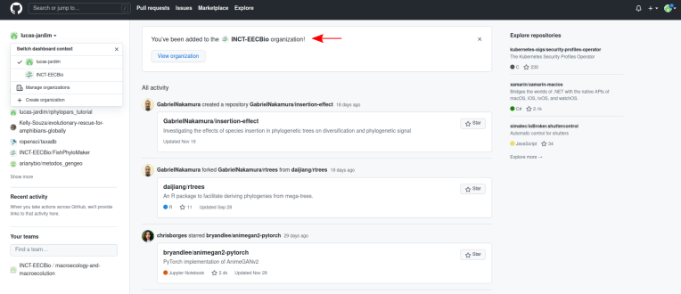
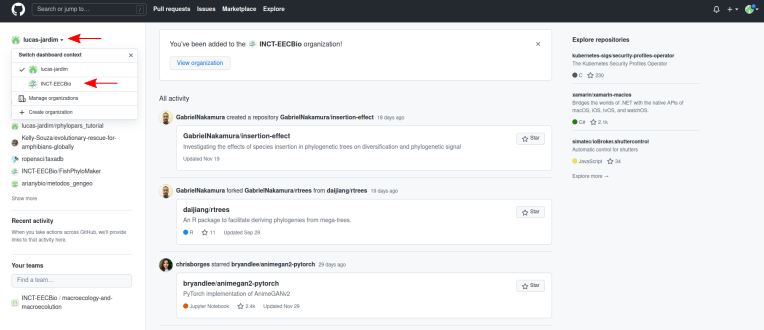
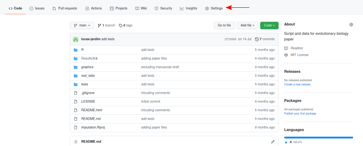
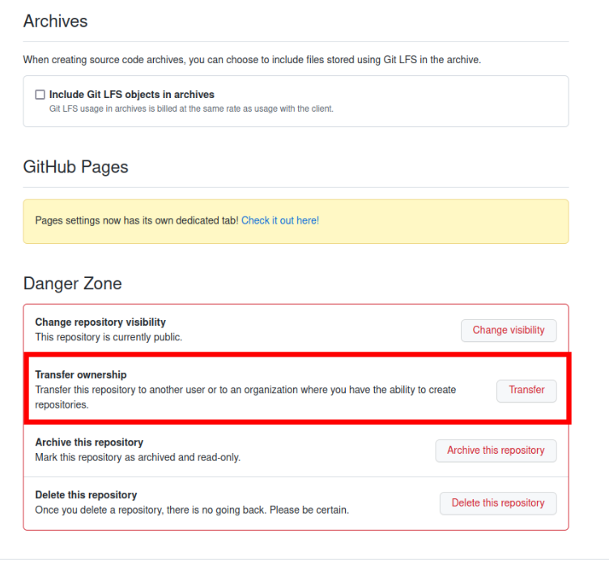

   

 

<h1> 
  

     Criar um repositório na conta do INCT-EECBio
  

</h1>

 

# Repositório INCT-EECBio

Há três opções para criar repositórios na conta do INCT-EECBio, (1) criando um repositório como INCT-EECBio, (2) transferindo um repositório para o INCT-EECBio ou (3) permitindo que o INCT-EECBio faça uma cópia (*fork*) do repositório.

### 1- Criando repositório como INCT-EECBio

Uma vez membro da organização INCT-EECBio, o membro tem permissão de criar repositórios na organização. 

 

O repositório pode ser criado na conta do INCT-EECBio trocando o usuário e seguindo os passos sobre como criar um repositório descritos [aqui]().

### 2 - *Fork* do repositório

Para que o INCT-EECBio faça um *fork* do repositório, envie um e-mail para eecbioinct_at_gmail.com e informe que há um repositório desenvolvido com financiamento do INCT-EECBio e informe o endereço do repositório.

### 3 - Transferir um repositório

Há também a opção de transferir a administração de um repositório para a conta do INCT-EECBio. Nesse caso o usuário deixará de possuir o repositório, que passará a ser do INCT-EECBio. Essa opção é menos a recomendada, pois o repositório deixará de fazer parte do portfolio de projetos do usuário.

Para transferir um repositório, clique em **Settings**.

 

 

Em seguida, clique em **Options**. 

 

Por fim, desça a página até **Danger Zone** e clique em **Transfer** na caixa **Transfer ownership**. Antes de transferir envie um e-mail para eecbioinct_at_gmail.com para que a transferência seja organizada em conjunto com a administração do INCT-EECBio.

 

